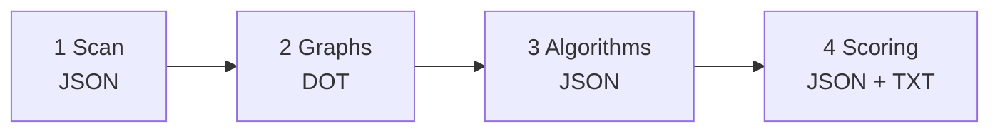

# solid-static-analysis

Ferramenta de **análise estática em Java** que corre um **pipeline em cadeia**: extrai informação do código-fonte com [JavaParser](https://github.com/javaparser/javaparser), gera **grafos Graphviz (DOT)** com dependências, herança, chamadas, uso de campos, interfaces e CFG por método, calcula **métricas e algoritmos em grafos** com [JGraphT](https://jgrapht.org/), e por fim produz **pontuações SOLID** (S/O/L/I/D) com ficheiros **JSON** e relatórios **legíveis em texto**.

Este README descreve **passo a passo** como o projeto está organizado, como compilar, como correr cada etapa, onde cada ficheiro é gravado e como interpretar a configuração.

---

## Índice

1. [Glossário (leia primeiro)](#1-glossário-leia-primeiro)
2. [Visão geral do pipeline](#2-visão-geral-do-pipeline)
3. [Estrutura de diretórios do repositório](#3-estrutura-de-diretórios-do-repositório)
4. [Requisitos de ambiente](#4-requisitos-de-ambiente)
5. [Compilar o projeto](#5-compilar-o-projeto)
6. [Referência da linha de comandos (CLI)](#6-referência-da-linha-de-comandos-cli)
7. [Etapa 1 — Scan (AST → JSON)](#7-etapa-1--scan-ast--json)
8. [Etapa 2 — Grafos (`--graphs`, DOT)](#8-etapa-2--grafos---graphs-dot)
9. [Etapa 3 — Algoritmos (`--analyze`)](#9-etapa-3--algoritmos---analyze)
10. [Etapa 4 — Scoring SOLID (`--score`)](#10-etapa-4--scoring-solid---score)
11. [Etapa 5 — Pipeline completo (`--all`)](#11-etapa-5--pipeline-completo---all)
12. [Onde a saída é gravada (regra do `user.dir`)](#12-onde-a-saída-é-gravada-regra-do-userdir)
13. [Ficheiro `analysis.properties` (thresholds e relaxamento)](#13-ficheiro-analysisproperties-thresholds-e-relaxamento)
14. [Projetos pequenos vs grandes (estratégia de scoring)](#14-projetos-pequenos-vs-grandes-estratégia-de-scoring)
15. [Benchmarks e fixtures](#15-benchmarks-e-fixtures)
16. [Testes automatizados](#16-testes-automatizados)
17. [Javadoc da API (HTML gerado pelo Maven)](#17-javadoc-da-api-html-gerado-pelo-maven)
18. [Códigos de saída e mensagens](#18-códigos-de-saída-e-mensagens)
19. [Limitações conhecidas](#19-limitações-conhecidas)
20. [Documentação por feature (`specs/`)](#20-documentação-por-feature-specs)

---

## 1. Glossário (leia primeiro)

| Termo | Significado |
|--------|-------------|
| **`user.dir`** | Diretório de trabalho atual do processo Java (onde corres `java -jar …`). Muitas decisões de caminho dependem disto. |
| **Raiz do projeto analisado** | Caminho **absoluto** que passas ao scan ou ao `--all`: a árvore de `.java` a percorrer. |
| **Diretório de saída do projeto** | Pasta que contém, em simultâneo: **`ast/`** com os JSON do scan (espelhando pacotes), `graphs/`, `algorithms/`, e após scoring `scoring/` e `results/`. |
| **Raiz do repositório (merge de propriedades)** | Para **`--score`** e para o **`--all`**, o código usa `Paths.get(System.getProperty("user.dir"))` como pasta onde procurar `analysis.properties` **adicional** a fazer merge sobre o ficheiro embutido no JAR. Na prática: corre o JAR a partir da raiz do **solid-static-analysis** se quiseres usar o `analysis.properties` da raiz do repo. |
| **JAR shaded** | Um único `.jar` com dependências empacotadas; o `Main-Class` é `com.solidanalysis.SolidAnalysisCli`. |

**Regra importante:** quase todos os caminhos que passas à CLI têm de ser **absolutos** (o programa valida e recusa caminhos relativos).

---

## 2. Visão geral do pipeline

| Ordem | Nome | Como invocar | Resumo |
|------:|------|--------------|--------|
| 1 | Scan | `java -jar … <ABS_RAIZ_JAVA>` | Um JSON por classe analisada. |
| 2 | Grafos | `java -jar … --graphs <ABS_DIR_PROJETO>` | Lê `ast/*.json`, escreve `graphs/*.dot` (G1–G7). |
| 3 | Algoritmos | `java -jar … --analyze <ABS_DIR_PROJETO>` | Lê `graphs/*.dot`, escreve `algorithms/…`. |
| 4 | Scoring | `java -jar … --score <ABS_DIR_PROJETO>` | Lê tudo, escreve `scoring/` e `results/`. |
| — | Tudo | `java -jar … --all <ABS_RAIZ_JAVA>` | Executa 1→2→3→4 em sequência. |



---

## 3. Estrutura de diretórios do repositório

```text
solid-static-analysis/
├── pom.xml                    # Build Maven (Java 17), shade, plugin Javadoc, recursos
├── analysis.properties        # Limiares do scorer + scoring.relax.k (copiado para o JAR)
├── README.md                  # Este guia
├── docs/                      # Pasta reservada para documentação local (.gitkeep); não obrigatória para correr o projeto
├── specs/                     # Especificações por feature (001 … 005)
├── benchmarks/                # Projetos Java de exemplo + scripts
│   ├── run-all.sh             # Corre --all em cada benchmark (saída em output/ na raiz do repo)
│   ├── good-project/ …      # Exemplo maior “bom”
│   ├── bad-project/ …       # Exemplo maior “mau”
│   └── …                      # Mini-exemplos por princípio SOLID
├── src/main/java/com/solidanalysis/
│   ├── SolidAnalysisCli.java  # Entrada única da aplicação (modos scan, graphs, analyze, score, all)
│   ├── scanner/               # Etapa 1: AST → modelo → JSON
│   ├── graphs/                # Etapa 2: JSON → DOT (G1–G7)
│   ├── algorithms/            # Etapa 3: DOT → métricas / algoritmos → JSON
│   └── scoring/               # Etapa 4: artefactos → SOLID + relatórios
├── src/main/resources/        # Recursos extra (o analysis.properties vem também da raiz via pom)
├── src/test/java/             # Testes JUnit 5 (unitários e integração)
└── src/test/resources/
    └── java-fixtures/         # Código de exemplo + output/ opcional versionado como referência
```

**Pacotes (código):**

- **`scanner`** — `JavaParser`, visita AST, extrai tipo principal, métodos, chamadas, estruturas de fluxo, etc.
- **`graphs`** — Carrega o JSON do scan em **`ast/`**, constrói grafos conceptuais e exporta DOT.
- **`algorithms`** — `DOTImporter` (JGraphT), SCC, graus, centralidade, LCOM, componentes, **Louvain** (por defeito em `--analyze` / `--all`, desligável com `--no-clustering`).
- **`scoring`** — Lê **`ast/`** + algoritmos + grafos conforme necessário, aplica `analysis.properties`, escreve `scoring/*.json` e `results/*.txt`.

---

## 4. Requisitos de ambiente

| Componente | Notas |
|------------|--------|
| **JDK 17+** | O `pom.xml` compila com `source`/`target` **17**. Podes correr com JRE 17+ do JAR compilado. |
| **Maven 3.9+** | Para `mvn package`, `mvn test`, `mvn javadoc:javadoc`. |
| **Graphviz (`dot`)** | **Opcional**: só para converter/visualizar `.dot`. O JAR **não** invoca o Graphviz em runtime. |
| **JDK com `javadoc`** | **Opcional**: para gerar HTML de API (secção [17](#17-javadoc-da-api-html-gerado-pelo-maven)). Em alguns sistemas só está o JRE; instala o pacote **JDK completo** (ex.: `openjdk-17-jdk` no Debian/Ubuntu). |

---

## 5. Compilar o projeto

Na raiz do repositório:

```bash
mvn clean package
```

**Saída principal:**

```text
target/solid-static-analysis.jar
```

O goal `package` corre testes **não** excluídos pelo Surefire e depois o **shade**, que produz o JAR executável único.

---

## 6. Referência da linha de comandos (CLI)

Sintaxe aceite (mensagem de usage oficial do `SolidAnalysisCli`):

```text
java -jar solid-static-analysis.jar <ABS_ROOT_DIR>

java -jar solid-static-analysis.jar --graphs <ABS_PROJECT_JSON_DIR>

java -jar solid-static-analysis.jar --analyze <ABS_PROJECT_OUTPUT_DIR> [--no-clustering]

java -jar solid-static-analysis.jar --score <ABS_PROJECT_OUTPUT_DIR>

java -jar solid-static-analysis.jar --all <ABS_PROJECT_ROOT_DIR> [--output <ABS_PROJECT_OUTPUT_DIR>] [--no-clustering]

java -jar solid-static-analysis.jar --all --output <ABS_PROJECT_OUTPUT_DIR> <ABS_PROJECT_ROOT_DIR> [--no-clustering]
```

- **`--clustering`** existe como **no-op** (compatibilidade); o Louvain está **ligado por defeito**.
- **`--no-clustering`** desliga a clusterização onde é opcional (campos `clusters` vazios onde aplicável).

---

## 7. Etapa 1 — Scan (AST → JSON)

```bash
cd /caminho/para/solid-static-analysis
java -jar target/solid-static-analysis.jar /caminho/absoluto/para/projeto-java
```

**Comportamento:**

- Percorre recursivamente `.java` sob a raiz indicada.
- Por ficheiro com sucesso, grava um **JSON** com estrutura resumida (tipo, métodos, chamadas, fluxo, etc.).
- **Onde grava:** dentro de **`ast/`** sob o diretório de saída (o próprio scan usa essa pasta como raiz dos JSON).
- **Caminhos dentro de `ast/`:** espelham a árvore de pastas relativamente à raiz do scan; prefixos habituais `src/main/java` e `src/test/java` são **omitidos** no espelho quando detetados.

**Saída no disco:** ver [secção 12](#12-onde-a-saída-é-gravada-regra-do-userdir) — por defeito `./output/` sob o `user.dir`.

No fim, o resumo típico em stdout: `Parsed: N, Failed: M` (falhas por ficheiro **não** abortam o lote inteiro).

---

## 8. Etapa 2 — Grafos (`--graphs`, DOT)

**Pré-requisito:** o diretório de projeto já contém **`ast/`** com os JSON da etapa 1 (não passes só a raiz do código-fonte).

```bash
java -jar target/solid-static-analysis.jar --graphs /abs/.../output/meu-projeto
```

**Cria** (no mesmo diretório de projeto) a pasta `graphs/` com ficheiros DOT, incluindo:

| Ficheiro / pasta | Ideia geral |
|------------------|-------------|
| `g1_dependency.dot` | Dependências entre classes do projeto (G1). |
| `g2_inheritance.dot` | Herança / extends. |
| `g3_method_calls.dot` (por classe espelhada) | Chamadas entre métodos. |
| `g4_field_usage.dot` / projeção | Uso de campos e projeção para coesão. |
| `g5_interface_impl.dot` | Interfaces e implementações. |
| `g6_interface_usage.dot` | Uso de interfaces como tipo. |
| `g7_cfg/*.dot` | CFG por método (quando gerado). |

Para **ver** um grafo: com Graphviz instalado, por exemplo `dot -Tpng graphs/g1_dependency.dot -o g1.png`.

---

## 9. Etapa 3 — Algoritmos (`--analyze`)

**Pré-requisito:** o mesmo diretório de projeto contém `graphs/` com DOT e **`ast/`** com os JSON do scan.

```bash
java -jar target/solid-static-analysis.jar --analyze /abs/.../output/meu-projeto
java -jar target/solid-static-analysis.jar --analyze /abs/.../output/meu-projeto --no-clustering
```

**Estrutura típica** em `algorithms/`:

- `g1_algorithms.json`, `g2_algorithms.json`, …
- `g3_algorithms/<Classe>.json`, `g4_field_algorithms/…`, `g4_projection_algorithms/…`
- `g5_algorithms.json`, `g6_algorithms.json` (G6 pode ser vazio estruturado quando não há interfaces no G5)
- `g7_algorithms/<Classe>_<Metodo>.json` quando existir CFG

O **Louvain** preenche `clusters` em pontos do pipeline onde o modelo o prevê (G1, G3 por classe, G4 projeção), salvo `--no-clustering`.

---

## 10. Etapa 4 — Scoring SOLID (`--score`)

**Pré-requisito:** diretório de projeto com **`ast/`** (JSON do scan), `graphs/` e `algorithms/` consistentes.

```bash
java -jar target/solid-static-analysis.jar --score /abs/.../output/meu-projeto
```

**Gera:**

- `scoring/<NomeClasse>.json` — por classe: princípios S/O/L/I/D, indicadores, níveis.
- `scoring/project_summary.json` — visão do projeto.
- `results/<NomeClasse>.txt` e `results/project_summary.txt` — relatório legível (usa sobretudo o texto `detail` dos indicadores; métricas brutas aparecem aí quando descritas).

**Campos úteis no JSON (modo relaxado, projetos pequenos):**

- `relaxFactor` — valor \(f(n)=n/(n+k)\) para o projeto.
- `rawMetric` — valor bruto da métrica (quando exposto).
- `value` — para indicadores contínuos relaxados: tipicamente **métrica bruta × relaxFactor**; a **classificação** ALTO/MEDIO/BAIXO desses indicadores compara este **`value`** com os limiares **nominais** de `analysis.properties`.

O `ScoringRunner` usa `user.dir` como pasta do ficheiro `analysis.properties` opcional (merge). Ver glossário.

---

## 11. Etapa 5 — Pipeline completo (`--all`)

```bash
cd /caminho/para/solid-static-analysis
java -jar target/solid-static-analysis.jar --all /abs/para/projeto-fonte
```

Ordem interna: **scan → graphs → analyze → score**.

**Saída explícita** (útil para fixtures ou CI):

```bash
java -jar target/solid-static-analysis.jar --all /abs/projeto-fonte --output /abs/pasta-saida
# ou ordem alternativa aceite:
java -jar target/solid-static-analysis.jar --all --output /abs/pasta-saida /abs/projeto-fonte
```

**Flags:** `--no-clustering` propagado à etapa de algoritmos dentro do `--all`.

---

## 12. Onde a saída é gravada (regra do `user.dir`)

| Cenário | Onde os ficheiros aparecem |
|---------|----------------------------|
| Scan só (um argumento) | `./output/ast/` relativo ao **`user.dir`** (não relativo ao projeto analisado). |
| `--all` sem `--output` | `./output/...` sob `user.dir`, com subpasta derivada da raiz absoluta (se estiver **dentro** de `user.dir`, espelha caminho relativo; caso contrário segmento sanitizado — implementação em `ProjectOutputPathResolver`). |
| `--all --output /abs/X` | Tudo diretamente sob `/abs/X/`. |
| `--graphs` / `--analyze` / `--score` | Escrevem **no diretório que passas** (deve ser o diretório de saída do projeto). |

**Benchmarks:** `./benchmarks/run-all.sh` grava em `output/<nome-do-benchmark>/` na raiz do repo (pastas comuns estão referidas no `.gitignore`).

**Fixtures versionados:** podes regenerar `src/test/resources/java-fixtures/output/` com `--all` + `--output` apontando para essa pasta (ver [15](#15-benchmarks-e-fixtures)).

---

## 13. Ficheiro `analysis.properties` (thresholds e relaxamento)

- **No JAR:** existe uma cópia em `/analysis.properties` (empacotada pelo Maven a partir da raiz do repo).
- **No disco:** se existir `analysis.properties` em **`user.dir`** (tipicamente a raiz do clone ao correres daí), as chaves presentes **substituem** as do JAR (**merge**: só o que está definido no ficheiro local sobrescreve).

**Chaves centrais:**

- `scoring.relax.k` — inteiro \(k \ge 0\) na fórmula \(f(n)=n/(n+k)\) para projetos com **menos de 10 classes** (`FIXED_THRESHOLD_RELAXED`). Com `k=0`, o comportamento efetivo é sem escala (`f=1` conforme implementação).
- `threshold.*` — limiares para LCOM, clusters de projeção, proporção de métodos isolados, profundidade de herança, fan-out de `switch`, grau de dependências, etc.

Alterar thresholds **não** exige recompilar se usares o `analysis.properties` no `user.dir`; **exige** recompilar se mudares só o ficheiro na raiz **e** quiseres que o valor embutido no JAR mude para outros ambientes que não carreguem o ficheiro local.

---

## 14. Projetos pequenos vs grandes (estratégia de scoring)

| Tamanho (classes no output) | Estratégia no JSON | Notas |
|----------------------------|--------------------|--------|
| **&lt; 10** | `FIXED_THRESHOLD_RELAXED` | Aparece `relaxFactor`. Indicadores contínuos relaxados usam `value` escalado para comparar com limiares nominais. |
| **≥ 10** | `Z_SCORE` | Comparação por z-score entre classes do mesmo projeto; **`scoring.relax.k` não altera** esta estratégia. |

---

## 15. Benchmarks e fixtures

### Benchmarks (`benchmarks/`)

```bash
./benchmarks/run-all.sh
```

Corre o pipeline completo sobre cada subpasta de benchmark e escreve resultados sob `output/` na raiz do repositório (conforme `.gitignore`). Serve para inspecionar diferenças “good vs bad” por princípio SOLID.

### Fixtures (`src/test/resources/java-fixtures`)

- Código-fonte de exemplo em `*.java`.
- **`output/`** opcional: snapshot de referência (JSON, `graphs/`, `algorithms/`, `scoring/`, `results/`). Instruções em `src/test/resources/java-fixtures/output/README.txt`.

Regeneração típica (a partir da raiz do repo, com `user.dir` = raiz do repo para o merge de `analysis.properties`):

```bash
mvn -q package
java -jar target/solid-static-analysis.jar --all "$(pwd)/src/test/resources/java-fixtures" \
  --output "$(pwd)/src/test/resources/java-fixtures/output"
```

---

## 16. Testes automatizados

```bash
mvn test
```

O Surefire **exclui por defeito** testes anotados com a tag JUnit **`@Tag("clustering")`** (integração mais pesada). Para correr **todos**:

```bash
mvn test -Dsurefire.excludedGroups=
```

---

## 17. Javadoc da API (HTML gerado pelo Maven)

O Javadoc **não** é commitado no Git: a pasta `target/` está no `.gitignore`. É gerado **localmente** sempre que executas o goal do plugin.

### Onde o HTML é gravado

Após um build bem-sucedido com o plugin configurado no `pom.xml`:

| Item | Localização |
|------|-------------|
| **Página inicial** | `target/site/apidocs/index.html` |
| **Páginas por pacote / classe** | `target/site/apidocs/com/solidanalysis/...` |

Caminho completo no disco: **`<raiz-do-repo>/target/site/apidocs/`**.

### Como gerar

```bash
cd /caminho/para/solid-static-analysis
export JAVA_HOME=/caminho/para/jdk-17    # JDK que contenha bin/javadoc
mvn javadoc:javadoc
```

Abre no browser: `target/site/apidocs/index.html`.

### Problemas frequentes

- **“Unable to find javadoc command”** — `JAVA_HOME` aponta para um JRE ou JDK sem `bin/javadoc`. Instala um JDK completo e volta a definir `JAVA_HOME`.
- **`mvn clean`** — apaga `target/`, incluindo o Javadoc gerado; é preciso correr `mvn javadoc:javadoc` outra vez.

---

## 18. Códigos de saída e mensagens

| Situação | Exit code | Onde |
|----------|-----------|------|
| Scan / pipeline terminou (pode haver falhas parciais por ficheiro no scan) | `0` | Erros por ficheiro em **stdout**; resumo `Parsed: N, Failed: M` |
| Argumentos inválidos, caminho não absoluto, diretório inexistente, erro fatal | `≠ 0` (normalmente `1`) | **stderr** |

Contrato detalhado do scan: [specs/001-ast-parser/contracts/cli.md](specs/001-ast-parser/contracts/cli.md).

---

## 19. Limitações conhecidas

- Resolução de tipos via JavaParser (`CombinedTypeSolver`) com fontes sob a raiz analisada e JDK; **dependências Maven externas não são resolvidas automaticamente** nesta versão.
- Por ficheiro `.java`: exporta o **primeiro** tipo `class` ou `interface` de nível superior.

---

## 20. Documentação por feature (`specs/`)

- **001 — AST / JSON:** [specs/001-ast-parser/spec.md](specs/001-ast-parser/spec.md)
- **002 — Grafos DOT:** [specs/002-generate-dot-graphs/spec.md](specs/002-generate-dot-graphs/spec.md), [quickstart.md](specs/002-generate-dot-graphs/quickstart.md)
- **003 — Algoritmos:** [specs/003-analyze-graph-algorithms/spec.md](specs/003-analyze-graph-algorithms/spec.md), [quickstart.md](specs/003-analyze-graph-algorithms/quickstart.md)
- **004 — Scoring SOLID:** [specs/004-solid-scoring/spec.md](specs/004-solid-scoring/spec.md), [quickstart.md](specs/004-solid-scoring/quickstart.md), [contracts/score-cli.md](specs/004-solid-scoring/contracts/score-cli.md)
- **005 — Benchmarks / docs:** [specs/005-add-solid-benchmarks-docs/spec.md](specs/005-add-solid-benchmarks-docs/spec.md)
