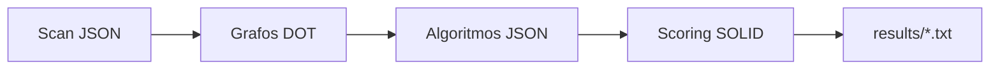

# solid-static-analysis

Pipeline de **análise estática em Java**: extrai estrutura e métricas do código, constrói **grafos** (Graphviz DOT), corre **algoritmos em grafos** (JGraphT) e produz **pontuações SOLID** com relatórios JSON e texto.

---

## Índice

- [Visão geral](#visão-geral)
- [Estrutura do repositório](#estrutura-do-repositório)
- [Requisitos](#requisitos)
- [Início rápido](#início-rápido)
- [Etapas do pipeline](#etapas-do-pipeline)
- [Onde a saída é gravada](#onde-a-saída-é-gravada)
- [Configuração (`analysis.properties`)](#configuração-analysisproperties)
- [Scoring: projetos pequenos vs grandes](#scoring-projetos-pequenos-vs-grandes)
- [Benchmarks e fixtures](#benchmarks-e-fixtures)
- [Testes e Javadoc](#testes-e-javadoc)
- [Argumentos e códigos de saída](#argumentos-e-códigos-de-saída)
- [Limitações](#limitações)
- [Documentação por feature (specs)](#documentação-por-feature-specs)

---

## Visão geral

| Etapa | Comando / modo | Entrada principal | Saída principal |
|-------|----------------|-------------------|-----------------|
| **1 — Scan** | *(argumento único: raiz absoluta)* | Árvore de `.java` | `*.json` por classe (AST resumido) |
| **2 — Grafos** | `--graphs <dir>` | Diretório com JSON da etapa 1 | `graphs/*.dot` (G1–G7) |
| **3 — Algoritmos** | `--analyze <dir>` | `graphs/` + JSON | `algorithms/*.json` (métricas, SCC, LCOM, Louvain opcional, etc.) |
| **4 — Scoring** | `--score <dir>` | JSON + `graphs/` + `algorithms/` | `scoring/*.json`, `results/*.txt` |
| **5 — Pipeline completo** | `--all <raiz>` | Raiz do projeto fonte | Etapas 1–4 em sequência |

O ponto de entrada do JAR (shade) é **`com.solidanalysis.SolidAnalysisCli`**.

Fluxo lógico:



---

## Estrutura do repositório

```text
solid-static-analysis/
├── pom.xml                      # Maven: Java 17, shade JAR, recursos (analysis.properties)
├── analysis.properties          # Limiares do scorer + scoring.relax.k (também no JAR)
├── README.md                    # Este ficheiro
├── docs/                        # Documentação ad-hoc (ex.: comparação k)
├── specs/                       # Especificações por feature (001–005)
├── benchmarks/                  # Projetos de exemplo + run-all.sh
├── src/main/java/com/solidanalysis/
│   ├── SolidAnalysisCli.java    # CLI principal
│   ├── scanner/                 # Etapa 1 — parse AST (JavaParser) → JSON
│   ├── graphs/                  # Etapa 2 — geração DOT
│   ├── algorithms/              # Etapa 3 — leitura DOT, métricas, algoritmos
│   └── scoring/                 # Etapa 4 — SOLID, thresholds, relaxamento
├── src/main/resources/          # Recursos adicionais (se existirem)
├── src/test/java/               # Testes JUnit 5 (espelha pacotes de produção)
└── src/test/resources/
    └── java-fixtures/           # Mini-projeto para testes + output de referência opcional
        ├── *.java
        └── output/              # Snapshot regenerável (--all --output)
```

**Pacotes principais**

- **`scanner`** — visita AST, extrai tipos, métodos, chamadas, fluxo, etc., serializa em JSON.
- **`graphs`** — lê JSON da etapa 1 e materializa grafos G1–G7 em DOT.
- **`algorithms`** — importa DOT (JGraphT), calcula SCC, graus, caminhos, LCOM, componentes, clusterização Louvain (por defeito em `--analyze` / `--all`).
- **`scoring`** — lê artefactos 1–3, aplica limiares de `analysis.properties`, agrega princípios S/O/L/I/D e escreve JSON + relatórios legíveis.

---

## Requisitos

- **JDK 17+** para compilar e correr o projeto (o `pom.xml` fixa `source` / `target` em **17**).
- **Maven 3.9+**.
- **Javadoc** (opcional): para `mvn javadoc:javadoc`, use um JDK completo (ex.: pacote `openjdk-17-jdk`) com `bin/javadoc` disponível; defina `JAVA_HOME` para esse JDK se o Maven não encontrar o executável.
- **Graphviz** (`dot`) — apenas para visualizar ou converter ficheiros `.dot` gerados na etapa 2; não é exigido em tempo de execução do JAR.

---

## Início rápido

```bash
git clone <repo>
cd solid-static-analysis
mvn clean package
```

JAR gerado:

```text
target/solid-static-analysis.jar
```

Analisar um projeto (pipeline completo), a partir da raiz deste repositório:

```bash
java -jar target/solid-static-analysis.jar --all /caminho/absoluto/para/o/projeto-java
```

Saída por defeito: `output/<segmento>/` relativo ao diretório onde corres o comando (`user.dir`). Ver [Onde a saída é gravada](#onde-a-saída-é-gravada).

Com saída explícita:

```bash
java -jar target/solid-static-analysis.jar --all /abs/projeto --output /abs/saida-projeto
```

---

## Etapas do pipeline

### 1 — Scan (AST → JSON)

```bash
java -jar target/solid-static-analysis.jar /caminho/absoluto/para/o/projeto-java
```

- Um JSON por ficheiro `.java` analisado.
- Caminhos no output espelham a árvore sob a raiz do scan (prefixos `src/main/java` e `src/test/java` são omitidos no espelho quando aplicável).

### 2 — Grafos (`--graphs`)

```bash
java -jar target/solid-static-analysis.jar --graphs /abs/.../output/meu-projeto
```

Gera `graphs/` com `g1_dependency.dot` … `g6_interface_usage.dot` e `g7_cfg/*.dot` quando existir CFG por método.

### 3 — Algoritmos (`--analyze`)

```bash
# Louvain ativo por defeito onde aplicável
java -jar target/solid-static-analysis.jar --analyze /abs/.../output/meu-projeto

# Sem clusterização
java -jar target/solid-static-analysis.jar --analyze /abs/.../output/meu-projeto --no-clustering
```

Estrutura típica em `algorithms/`: `g1_algorithms.json`, `g2_…`, `g3_algorithms/<Classe>.json`, `g4_field_algorithms/…`, `g4_projection_algorithms/…`, `g5_…`, `g6_…`, `g7_algorithms/<Classe>_<Metodo>.json`.

### 4 — Scoring (`--score`)

```bash
java -jar target/solid-static-analysis.jar --score /abs/.../output/meu-projeto
```

Gera `scoring/<Classe>.json`, `scoring/project_summary.json` e `results/*.txt` (+ `project_summary.txt`).

### 5 — Tudo (`--all`)

Executa as etapas 1–4 em sequência. Flags úteis:

- `--output <dir>` — raiz de saída explícita.
- `--no-clustering` — desativa Louvain na etapa 3 dentro do `--all`.

---

## Onde a saída é gravada

| Fluxo | O que grava | Onde fica |
|-------|-------------|-----------|
| Scan (um argumento) | JSON por `.java` | `./output/` no **`user.dir`** |
| `--all` sem `--output` | Etapas 1–4 | `./output/<caminho relativo ao user.dir>/` se a raiz analisada estiver dentro do `user.dir`; senão segmento sanitizado (ver `ProjectOutputPathResolver`) |
| `--all --output /abs/X` | Etapas 1–4 | Diretamente sob `/abs/X/` |
| Fixtures de referência | Snapshot opcional | `src/test/resources/java-fixtures/output/` (regenerar com `--all` + `--output`) |

**Importante:** ao correr o CLI, o ficheiro **`analysis.properties` na raiz do repositório** (ou no `user.dir`) faz **merge** por cima do ficheiro empacotado no JAR — útil para ajustar `scoring.relax.k` e limiares sem recompilar.

---

## Configuração (`analysis.properties`)

- Empacotado como `/analysis.properties` no JAR.
- Chaves principais:
  - **`scoring.relax.k`** — parâmetro \(k\) em \(f(n)=n/(n+k)\) para projetos com **&lt; 10 classes** (`FIXED_THRESHOLD_RELAXED`).
  - **`threshold.*`** — limiares nominais para LCOM, clusters de projeção, razão de métodos isolados, profundidade de herança, etc.

No JSON de scoring, para indicadores contínuos relaxados: **`value` = métrica bruta × \(f(n)\)**; **`rawMetric`** repete o valor bruto quando relevante. A **classificação** (ALTO / MEDIO / BAIXO) desses indicadores compara **`value`** com os limiares nominais deste ficheiro.

Relatório de exemplo **k=5 vs k=100** no fixture: [docs/java-fixtures-k5-vs-k100.md](docs/java-fixtures-k5-vs-k100.md).

---

## Scoring: projetos pequenos vs grandes

- **&lt; 10 classes** no output analisado → estratégia **`FIXED_THRESHOLD_RELAXED`** com `relaxFactor` no JSON.
- **≥ 10 classes** → **`Z_SCORE`** nos sinais contínuos (o `k` **não** altera esses projetos).

---

## Benchmarks e fixtures

### Benchmarks (`benchmarks/`)

Vários mini-projetos por princípio SOLID e um `good-project` / `bad-project` maior. Script:

```bash
./benchmarks/run-all.sh
```

Gera saída sob `output/<nome-do-benchmark>/` na raiz do repositório (respeitando `.gitignore`).

### Fixtures (`src/test/resources/java-fixtures`)

- Fontes: `*.java` no diretório do fixture.
- **`java-fixtures/output/`** — snapshot opcional; regenerar:

```bash
mvn -q package
java -jar target/solid-static-analysis.jar --all "$(pwd)/src/test/resources/java-fixtures" \
  --output "$(pwd)/src/test/resources/java-fixtures/output"
```

Os testes também podem usar cache em `target/java-fixtures-pipeline-cache/`.

---

## Testes e Javadoc

### Testes

```bash
mvn test
```

Por defeito o Surefire **exclui** testes com a tag JUnit **`clustering`** (integração mais pesada). Para incluir:

```bash
mvn test -Dsurefire.excludedGroups=
```

### Javadoc

Gera API HTML em **`target/site/apidocs/`**:

```bash
export JAVA_HOME=/caminho/para/jdk-17   # JDK com bin/javadoc
mvn javadoc:javadoc
```

Abrir `target/site/apidocs/index.html` no browser.

---

## Argumentos e códigos de saída

| Situação | Exit code | Onde mensagens |
|----------|-----------|----------------|
| Scan / pipeline concluído (pode haver falhas parciais por ficheiro) | `0` | Falhas por ficheiro em **stdout**; resumo `Parsed: N, Failed: M` |
| Argumentos inválidos, caminho não absoluto, I/O fatal | `≠ 0` (tipicamente `1`) | **stderr** |

Detalhe do contrato do scan: [specs/001-ast-parser/contracts/cli.md](specs/001-ast-parser/contracts/cli.md).

---

## Limitações

- Resolução de tipos via JavaParser + `CombinedTypeSolver` (fontes sob a raiz e JDK); dependências Maven externas **não** são resolvidas automaticamente nesta versão.
- Por ficheiro: exporta o **primeiro** tipo `class` / `interface` top-level.

---

## Documentação por feature (specs)

- **001 — AST / JSON**: [specs/001-ast-parser/spec.md](specs/001-ast-parser/spec.md)
- **002 — Grafos DOT**: [specs/002-generate-dot-graphs/spec.md](specs/002-generate-dot-graphs/spec.md), [quickstart.md](specs/002-generate-dot-graphs/quickstart.md)
- **003 — Algoritmos**: [specs/003-analyze-graph-algorithms/spec.md](specs/003-analyze-graph-algorithms/spec.md), [quickstart.md](specs/003-analyze-graph-algorithms/quickstart.md)
- **004 — Scoring SOLID**: [specs/004-solid-scoring/spec.md](specs/004-solid-scoring/spec.md), [quickstart.md](specs/004-solid-scoring/quickstart.md), [contracts/score-cli.md](specs/004-solid-scoring/contracts/score-cli.md)
- **005 — Benchmarks / docs**: [specs/005-add-solid-benchmarks-docs/spec.md](specs/005-add-solid-benchmarks-docs/spec.md)
